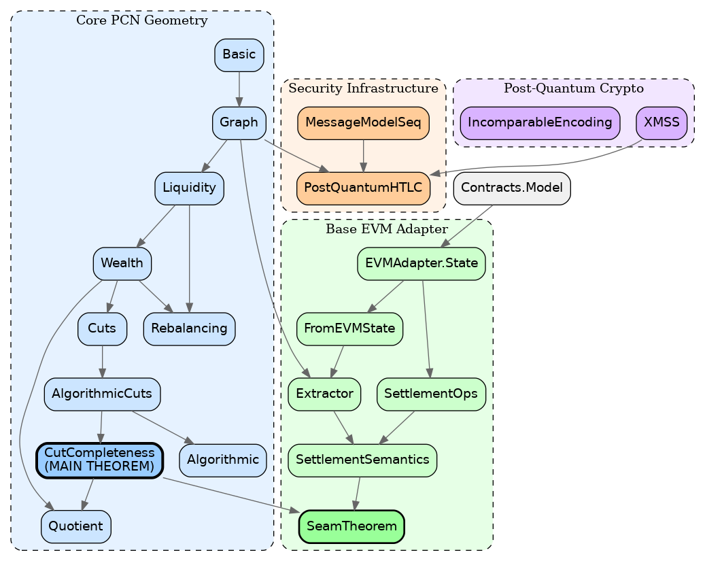

# Base PCN Algebraic Security

[](https://leanprover.github.io/)
[](https://github.com/leanprover-community/mathlib4)
[](LICENSE)
[](#verification)

**Machine-verified algebraic security proofs for Payment Channel Networks on Coinbase's Base blockchain.**

<p align="center">
  
</p>

---

## Why Algebraic Security?

Traditional blockchain security analysis relies on **cryptographic assumptions**:
- Hash function collision resistance
- Discrete logarithm hardness
- Signature unforgeability

These provide strong guarantees *if the assumptions hold*, but they can fail:
- Algorithm advances (e.g., Shor's algorithm for quantum computers)
- Implementation bugs in cryptographic primitives
- Parameter choices that don't match security claims

**Algebraic security** provides a different, complementary layer of guarantees:

| Property | Cryptographic Proof | Algebraic Proof |
|----------|---------------------|-----------------|
| **Depends on** | Computational hardness | Structural invariants |
| **Breaks when** | Algorithms improve | Mathematical contradiction |
| **Proves** | "Attacker can't forge" | "No valid state exists" |
| **Example** | "Can't find hash preimage" | "Payment exceeds cut capacity" |

This repository proves that **Base PCN security properties are algebraically necessary** — they hold for *any* implementation, regardless of which cryptographic primitives are used.

---

## Key Results

### 1. Feasibility Characterization (Hall's Theorem)

```lean
theorem mem_WG_iff_forall_cutIntervalHolds {G : ChannelGraph V} {w : V → Cap} :
    w ∈ Wealth.WG ↔ ∀ S : Finset V, cutIntervalHolds G w S
```

**What it means**: A wealth distribution is achievable on Base if and only if every possible "cut" (partition of addresses) satisfies capacity bounds. This is proven using [Hall's Marriage Theorem](https://en.wikipedia.org/wiki/Hall%27s_marriage_theorem) — pure combinatorics, no cryptography.

**Security implication**: If a proposed payment would violate any cut constraint, *no protocol implementation can make it succeed*. This is a mathematical impossibility, not a computational difficulty.

### 2. Rebalancing Invariance

```lean
theorem pi_eq_of_circulation (hλ : λ ∈ LG G) (hf : IsBoundedCirculation G λ f) :
    Wealth.pi G (applyFlow λ f) = Wealth.pi G λ
```

**What it means**: Redistributing funds along cycles doesn't change anyone's total wealth. Channel rebalancing is provably lossless.

### 3. Replay Prevention (Monotone Sequences)

```lean
theorem deliver_preserves_invariants (hinv : st.Invariants) (hsent : m ∈ st.sent) :
    (deliver st m).Invariants
```

**What it means**: The sequence-number mechanism prevents message replay — formalized as a state machine invariant, not a cryptographic assumption.

### 4. Post-Quantum Readiness

The model includes XMSS-style stateful signatures with epoch counters:

```lean
structure XMSSScheme where
  sign : Params → SecKey → Msg → SecKey × Signature
  verify : Params → PubKey → Msg → Signature → Prop
  EpochAdvances : Prop  -- signing increments epoch (no key reuse)
```

This provides a migration path to quantum-resistant settlement without changing the algebraic security layer.

---

## Base Blockchain Specifics

This formalization targets [Coinbase's Base](https://base.org), an Ethereum L2 built on the OP Stack.

### Modeled Features

| Feature | Model Location | Notes |
|---------|----------------|-------|
| EVM state | `EVMAdapter/State.lean` | Account balances, storage |
| Channel records | `EVMAdapter/State.lean` | On-chain channel data |
| Parallel channels | `EVMAdapter/Extractor.lean` | Multiple channels per address pair |
| Settlement ops | `EVMAdapter/SettlementOps.lean` | Open, close, splice, update |

### Parallel Channel Support

Base's EVM allows multiple channel contracts between the same two addresses. The model handles this via capacity aggregation:

```lean
def extractChannelGraphSumCap (cfg : ExtractorConfig) (s : EVMState) : ChannelGraph Address
-- Aggregates capacity by summing over all open channels per endpoint pair
```

### What's NOT Modeled

- **Sequencer behavior**: Base currently uses a centralized sequencer; this model assumes transactions are eventually included
- **Gas economics**: Transaction costs are orthogonal to feasibility
- **Bridge semantics**: L1↔L2 bridging is outside PCN scope

---

## Repository Structure

```
base-pcn-algebraic-security/
├── README.md                    # This file
├── TECHNICAL_REPORT.md          # Detailed proofs and security claims
├── LICENSE                      # MIT
├── RESEARCHER_BUNDLE/           # Self-contained Lean project
│   ├── lakefile.lean
│   ├── lean-toolchain
│   ├── HeytingLean.lean         # Main import
│   └── HeytingLean/
│       ├── Blockchain/
│       │   ├── PaymentChannels/
│       │   │   ├── Graph.lean           # Channel graph structure
│       │   │   ├── Liquidity.lean       # Feasible liquidity states
│       │   │   ├── Wealth.lean          # Wealth projection
│       │   │   ├── Cuts.lean            # Cut capacities
│       │   │   ├── CutCompleteness.lean # ★ MAIN THEOREM
│       │   │   ├── Rebalancing.lean     # Circulation invariance
│       │   │   ├── PostQuantumHTLC.lean # PQ settlement
│       │   │   └── EVMAdapter/          # Base/EVM integration
│       │   └── Bridge/
│       │       └── MessageModelSeq.lean # Replay prevention
│       └── Crypto/
│           └── PostQuantum/
│               └── XMSS.lean            # Stateful signatures
├── docs/
│   ├── 01_Module_Map.md
│   ├── 02_Proof_Index.md
│   └── 03_Reproducibility.md
├── artifacts/
│   ├── base_pcn_dependency_graph.dot
│   ├── base_pcn_dependency_graph.png
│   └── base_pcn_3d.html
└── scripts/
    └── verify_build.sh
```

---

## Verification

### Quick Start

```bash
cd RESEARCHER_BUNDLE

# Install dependencies (downloads Mathlib cache)
lake update

# Build with warnings as errors
lake build -- -DwarningAsError=true

# Run demo
lake exe base_pcn_evm_demo
```

### Expected Output

```
Extracted Address-graph edges.card = 3
cap(1,2) = 10
cap(2,3) = 5
cap(3,1) = 8
toy wealth: A=12, B=5, C=6
wgBool(toy wealth) = true
paymentFeasibleBool A→B a=2 = true
parallel channels demo: edges.card=1
capMax(1,2) = 10
capSum(1,2) = 17
```

### No Sorry Guarantee

```bash
grep -rn --include='*.lean' -E '\bsorry\b|\badmit\b' HeytingLean/
# Returns nothing — all proofs complete
```

---

## Security Claims Summary

| Claim | Type | Status | Location |
|-------|------|--------|----------|
| Wealth feasibility ↔ cut constraints | Algebraic | ✅ Proven | `CutCompleteness.lean:778` |
| Rebalancing preserves wealth | Algebraic | ✅ Proven | `Rebalancing.lean` |
| Quotient structure LG/ker(π) ≃ WG | Algebraic | ✅ Proven | `Quotient.lean` |
| Sequence numbers prevent replay | Structural | ✅ Proven | `MessageModelSeq.lean` |
| XMSS epochs prevent key reuse | Prop assumption | ✅ Stated | `XMSS.lean` |
| HTLC claim correctness | Prop assumption | ✅ Stated | `PostQuantumHTLC.lean` |

**Prop assumptions** are explicitly parameterized — they're not axioms but properties that any conforming implementation must satisfy.

---

## Citation

If you use this work in academic research:

```bibtex
@software{base_pcn_algebraic_2026,
  title = {Base PCN Algebraic Security: Machine-Verified Proofs for Payment Channel Networks},
  author = {HeytingLean Project},
  year = {2026},
  url = {https://github.com/Abraxas1010/base-pcn-algebraic-security},
  note = {Lean 4 formalization using Hall's theorem for feasibility characterization}
}
```

---

## Related Work

- [PCN Feasibility Lean](https://github.com/Abraxas1010/pcn-feasibility-lean) — Original feasibility formalization
- [Lightning Network TLA+](https://link.springer.com/chapter/10.1007/978-3-032-10794-7_16) — Model checking approach
- [leanEthereum](https://github.com/leanEthereum) — Ethereum protocol formalizations

---

## License

MIT License. See [LICENSE](LICENSE) for details.

---

<p align="center">
  <i>Proving security claims the mathematician's way: by demonstrating they follow necessarily from the structure of the problem.</i>
</p>
